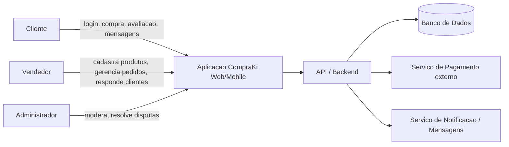

# Etapa 1 — Casos de Abuso e Modelagem de Ameaças com STRIDE

## 8.1 Identificação do sistema

**Nome do sistema:** CompraKi

**Integrantes do grupo:**
- Ariessa Velasques Oliveira ([@AriessaVelasques](https://github.com/AriessaVelasques))
- Alessandro Velasques Oliveira ([@AlessandroVOliveira](https://github.com/AlessandroVOliveira))
- Valdir Guilherme Tavares ([@ValdirGuiTavares](https://github.com/ValdirGuiTavares))
- Leonardo Paulino ([@LeonardoPaulino77](https://github.com/LeonardoPaulino77))
- Eric Moraes ([@MoraesEric55](https://github.com/MoraesEric55))
- Douglas Israel ([@DougIsrael](https://github.com/DougIsrael))

**Endereço do repositório:** https://github.com/AlessandroVOliveira/Entrega-software-seguro

**Justificativa para a escolha do sistema:**

O CompraKi foi escolhido por ser um marketplace de e-commerce, ou seja, uma plataforma que conecta clientes e vendedores terceiros sob a administração de uma empresa central. Esse formato reúne três perfis de usuário com interesses e níveis de acesso diferentes (cliente, vendedor e administrador), o que gera uma variedade maior de ameaças e casos de abuso do que uma loja única controlada por um só tipo de usuário. Além disso, o domínio de e-commerce envolve operações sensíveis (pagamento, dados pessoais, avaliações, mensagens entre cliente e vendedor) e se alinha com o uso do OWASP Juice Shop — uma aplicação de e-commerce vulnerável usada para fins educacionais — na verificação prática de vulnerabilidades prevista na Etapa 5.

## 8.2 Descrição do sistema

O CompraKi é um marketplace de e-commerce: uma plataforma onde vendedores terceiros cadastram e vendem seus próprios produtos, e clientes compram diretamente pelo site ou aplicativo, com a plataforma intermediando o pagamento, a logística de contato e a resolução de disputas.

**Problema que o sistema resolve:** pequenos e médios vendedores não precisam construir sua própria loja virtual, sistema de pagamento ou base de clientes — usam a infraestrutura já existente do CompraKi. Para os clientes, a plataforma concentra vários vendedores em um único lugar, com um único checkout e um único canal de suporte.

**Quem utiliza o sistema:**
- **Clientes**: pessoas físicas que navegam pelo catálogo, compram produtos, avaliam vendedores/produtos e trocam mensagens com vendedores.
- **Vendedores**: pessoas físicas ou empresas que cadastram produtos, gerenciam pedidos recebidos e respondem a clientes.
- **Administradores**: equipe do CompraKi responsável por moderar anúncios, mediar disputas entre clientes e vendedores, e gerenciar a operação da plataforma.

**Principais funcionalidades:**
- cadastro e login de clientes e vendedores;
- catálogo de produtos com busca e filtros;
- carrinho de compras e checkout;
- processamento de pagamento (cartão ou pix simulado);
- avaliações de produtos e de vendedores;
- mensagens diretas entre cliente e vendedor;
- painel do vendedor (cadastro de produtos, gestão de pedidos);
- painel administrativo (moderação de anúncios, mediação de disputas, suspensão de contas).

**Informações armazenadas ou transmitidas:** dados de cadastro (nome, e-mail, CPF, endereço), credenciais de acesso, dados de pagamento, histórico de pedidos, mensagens entre clientes e vendedores, avaliações e comentários, catálogo de produtos e preços.

**Recursos que precisam ser protegidos:** contas de usuário (contra acesso indevido), dados de pagamento, integridade dos valores de pedidos e preços, autenticidade das avaliações, e as funções administrativas (que, se comprometidas, afetam toda a plataforma).

## 8.3 Usuários, ativos e pontos de interação

**Usuários e perfis de acesso:**
- Cliente (comprador): navega, compra, avalia e troca mensagens com vendedores.
- Vendedor: cadastra produtos, gerencia seus próprios pedidos e responde clientes.
- Administrador: modera anúncios, resolve disputas e gerencia contas.

**Principais elementos do sistema:**

| Elemento | Descrição | Ativo crítico? |
|---|---|---|
| Credenciais de login | Senha/token de autenticação de clientes, vendedores e administradores | Sim |
| Dados pessoais | Nome, CPF, endereço de entrega | Sim |
| Dados de pagamento | Número de cartão (tokenizado) ou dados de pix | Sim |
| Histórico de pedidos | Registro de compras, valores e status | Sim |
| Avaliações | Notas e comentários sobre produtos e vendedores | Não (mas sensível a manipulação) |
| Mensagens | Comunicação direta entre cliente e vendedor | Não (mas contém dados pessoais) |
| Catálogo de produtos | Descrições, preços e estoque cadastrados pelos vendedores | Sim |
| Banco de dados | Armazena usuários, pedidos, produtos e mensagens | Sim |
| API/Backend | Camada que processa regras de negócio e autorização | Sim |
| Aplicativo web/mobile | Interface usada por clientes e vendedores | Não |
| Serviço de pagamento externo | Processa a cobrança efetiva (integração de terceiros) | Sim |
| Painel administrativo | Interface usada pelos administradores para moderar e decidir disputas | Sim |

Os elementos marcados como ativo crítico são aqueles cujo acesso indevido, alteração, destruição ou indisponibilidade causaria prejuízo financeiro direto, violação de privacidade ou perda de confiança na plataforma — por isso recebem atenção prioritária na modelagem de ameaças (seção 8.5).

## 8.4 Visão geral da arquitetura ou fluxo

O diagrama de contexto abaixo (fonte versionada em [`diagramas/etapa-1/diagrama-contexto.mmd`](../diagramas/etapa-1/diagrama-contexto.mmd)) mostra como os três perfis de usuário interagem com a aplicação CompraKi e como o backend se comunica com o banco de dados e com serviços externos:

Clientes, vendedores e administradores interagem com a mesma aplicação (web ou mobile), cada um com permissões diferentes. Toda ação passa pela API/Backend, que é responsável por aplicar as regras de autorização antes de ler ou gravar dados no banco. O backend também se comunica com dois serviços externos: um serviço de pagamento (que processa a cobrança efetiva) e um serviço de notificação/mensagens (que entrega mensagens entre cliente e vendedor e avisos do sistema). Por serem componentes externos, esses dois serviços representam pontos de confiança adicionais que também precisam ser considerados na análise de ameaças.

## 8.5 Modelagem de ameaças com STRIDE

A tabela abaixo aplica as seis categorias do STRIDE aos ativos e fluxos do CompraKi descritos nas seções anteriores. Cada categoria recebeu ao menos duas ameaças concretas, relacionadas a componentes específicos do sistema.

| ID | Categoria STRIDE | Componente ou ativo | Ameaça identificada | Possível impacto |
|---|---|---|---|---|
| T01 | Spoofing | Conta do cliente | Atacante usa credenciais roubadas (phishing ou reuso de senha) para acessar a conta e realizar compras ou alterar dados | Compras fraudulentas, exposição de dados pessoais, prejuízo financeiro à vítima |
| T02 | Spoofing | Conta do vendedor | Atacante cria uma conta de vendedor falsa se passando por uma marca conhecida para enganar compradores | Fraude contra clientes, dano à reputação da plataforma |
| T03 | Tampering | Valor do pedido | Usuário mal-intencionado intercepta e altera o valor do pedido antes da confirmação do pagamento | Prejuízo financeiro à plataforma ou ao vendedor |
| T04 | Tampering | Catálogo de produtos | Vendedor ou atacante altera descrição ou preço de um produto de forma não autorizada após a aprovação do anúncio | Enganar compradores, prejuízo financeiro, possíveis problemas jurídicos |
| T05 | Repudiation | Pedido/pagamento | Cliente nega ter realizado uma compra para tentar obter reembolso indevido, na ausência de registro de auditoria confiável | Prejuízo financeiro ao vendedor/plataforma, disputas sem resolução clara |
| T06 | Repudiation | Mensagens entre cliente e vendedor | Vendedor nega ter combinado um prazo ou condição informada por mensagem, na ausência de um log confiável da conversa | Disputas sem resolução, perda de confiança na plataforma |
| T07 | Information Disclosure | Banco de dados de usuários | Falha de autorização expõe dados pessoais e de pagamento de outros usuários | Violação de privacidade, dano reputacional, exposição a fraude |
| T08 | Information Disclosure | Painel do vendedor | Vendedor consegue visualizar dados de pedidos e clientes de outros vendedores por falha de segregação entre contas | Violação de privacidade de clientes, vazamento de dados comerciais |
| T09 | Denial of Service | Checkout/pagamento | Atacante envia grande volume de requisições ao checkout, sobrecarregando o serviço em datas de alta demanda | Indisponibilidade nas vendas, perda financeira direta |
| T10 | Denial of Service | API de busca de produtos | Consultas custosas repetidas (scraping agressivo) degradam a performance da busca para todos os usuários | Experiência do usuário degradada, possível perda de vendas |
| T11 | Elevation of Privilege | Painel administrativo | Vendedor explora falha de autorização e obtém acesso a funções reservadas a administradores | Moderação indevida, acesso a dados de todos os usuários, comprometimento total da plataforma |
| T12 | Elevation of Privilege | API de pedidos | Cliente comum manipula parâmetros da API para executar ações reservadas a administradores, como aprovar reembolsos | Fraude financeira, perda de controle sobre operações críticas |

As seis categorias do STRIDE foram cobertas com pelo menos duas ameaças concretas cada, totalizando doze ameaças (T01 a T12) relacionadas a ativos e componentes específicos do CompraKi descritos nas seções 8.3 e 8.4.

## 8.6 Casos de abuso

Cada caso de abuso a seguir foi elaborado a partir de uma das ameaças identificadas na seção 8.5, detalhando como um ator mal-intencionado (ou mesmo um usuário legítimo agindo de má-fé) poderia efetivamente explorá-la.

### CA03 — Negação de compra para obter reembolso indevido

**Ator:** cliente mal-intencionado.

**Objetivo:** obter reembolso de um pedido que efetivamente recebeu.

**Condições:** ausência de registro de auditoria detalhado (log de confirmação de entrega, aceite eletrônico do recebimento).

**Fluxo de abuso:**
1. O cliente realiza e recebe o pedido normalmente.
2. O cliente alega ao suporte que nunca fez a compra ou nunca recebeu o produto.
3. Na ausência de evidências consistentes, a plataforma processa o reembolso.
4. O cliente mantém o produto e recebe o dinheiro de volta.

**Impacto:** prejuízo financeiro ao vendedor e à plataforma, incentivo a fraudes recorrentes.

**Categorias STRIDE relacionadas:** Repudiation.

### CA01 — Sequestro de conta de cliente via credenciais roubadas

**Ator:** atacante externo mal-intencionado.

**Objetivo:** realizar compras fraudulentas e acessar dados pessoais da vítima.

**Condições:** a plataforma não exige verificação adicional (MFA) e o cliente reutiliza, no CompraKi, uma senha já vazada em outro serviço.

**Fluxo de abuso:**
1. O atacante obtém credenciais vazadas em outro serviço (data breach, phishing).
2. Testa as mesmas credenciais no CompraKi.
3. Consegue acesso à conta sem gerar alerta ao usuário legítimo.
4. Altera o endereço de entrega e realiza compras usando o cartão salvo.
5. Acessa o histórico de pedidos e os dados pessoais da vítima.

**Impacto:** prejuízo financeiro à vítima, exposição de dados pessoais, uso indevido de dados de pagamento salvos.

**Categorias STRIDE relacionadas:** Spoofing, Information Disclosure.

### CA04 — Exposição de dados de clientes por falha de segregação entre vendedores

**Ator:** vendedor legítimo, fazendo uso indevido de um acesso legítimo.

**Objetivo:** obter dados de clientes de outros vendedores para fins comerciais indevidos, como contato direto fora da plataforma.

**Condições:** o painel do vendedor não segrega corretamente os pedidos e dados por identificador do vendedor, permitindo acesso via manipulação de parâmetros.

**Fluxo de abuso:**
1. O vendedor acessa seu próprio painel normalmente.
2. Percebe que o identificador do pedido é sequencial e previsível na URL.
3. Altera o identificador para acessar pedidos de outros vendedores.
4. Visualiza dados pessoais e de contato de clientes que não são seus.

**Impacto:** violação de privacidade dos clientes, uso comercial indevido de dados, dano à reputação da plataforma.

**Categorias STRIDE relacionadas:** Information Disclosure, Elevation of Privilege.

### CA02 — Alteração do valor do pedido antes do pagamento

**Ator:** usuário mal-intencionado (cliente).

**Objetivo:** pagar um valor menor do que o real por um pedido.

**Condições:** a validação do valor do pedido ocorre apenas no lado do cliente (aplicativo ou navegador), sem revalidação no servidor no momento do pagamento.

**Fluxo de abuso:**
1. O atacante monta o carrinho normalmente.
2. Intercepta a requisição de checkout usando um proxy ou as ferramentas de desenvolvedor do navegador.
3. Altera o campo de valor total antes de enviar a requisição.
4. O servidor aceita o valor alterado sem revalidá-lo.
5. O pagamento é processado com o valor incorreto.

**Impacto:** prejuízo financeiro direto ao vendedor ou à plataforma.

**Categorias STRIDE relacionadas:** Tampering.

### CA06 — Escalonamento de privilégios via API de pedidos

**Ator:** cliente comum mal-intencionado.

**Objetivo:** executar ações administrativas, como aprovar reembolsos próprios sem análise.

**Condições:** a API de pedidos verifica a role do usuário apenas na interface, não em todas as chamadas realizadas ao servidor.

**Fluxo de abuso:**
1. O atacante identifica, observando o tráfego do aplicativo, o endpoint usado por administradores para aprovar reembolsos.
2. Monta manualmente uma requisição para esse endpoint usando sua própria sessão de cliente.
3. O servidor não revalida a permissão da role antes de executar a ação.
4. O reembolso é aprovado sem revisão humana.

**Impacto:** fraude financeira direta, perda de controle sobre um processo crítico, precedente para outros abusos semelhantes.

**Categorias STRIDE relacionadas:** Elevation of Privilege, Tampering.

### CA05 — Sobrecarga do checkout em datas de alta demanda

**Ator:** atacante externo (concorrente desleal ou mal-intencionado) explorando um pico de tráfego não gerenciado.

**Objetivo:** tornar o checkout indisponível para prejudicar as vendas da plataforma.

**Condições:** ausência de limitação de requisições (rate limiting) e de proteção contra automação no fluxo de checkout.

**Fluxo de abuso:**
1. O atacante identifica o endpoint de checkout.
2. Automatiza o envio de um grande volume de requisições simultâneas a esse endpoint.
3. O serviço de checkout fica sobrecarregado, tornando-se lento ou indisponível.
4. Clientes legítimos não conseguem finalizar suas compras durante o período do ataque.

**Impacto:** perda direta de vendas, insatisfação de clientes e vendedores, dano à reputação da plataforma.

**Categorias STRIDE relacionadas:** Denial of Service.
