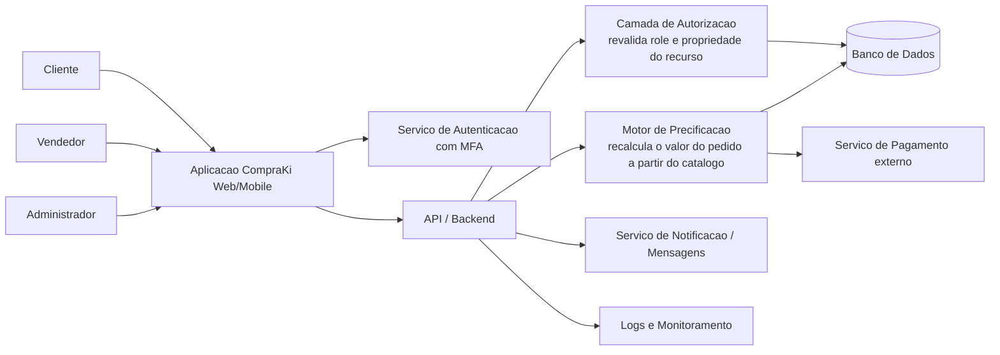

# Etapa 3 — Projeto de uma Arquitetura Segura

Esta etapa transforma os riscos e controles definidos na [Etapa 2](etapa-2-riscos-nist.md) em requisitos de segurança e decisões de arquitetura para o CompraKi. Os requisitos de segurança e o mapeamento de vulnerabilidades (seções 18.1 e 18.2) focam nos três riscos de maior prioridade da priorização geral (seção 13.6 da Etapa 2): R12, R07 e R03. As decisões de arquitetura (seção 18.4) incluem esses três riscos e também R01, quarto colocado na priorização, por envolver um componente estrutural (o serviço de autenticação) que vale a pena isolar desde já.

## 18.1 Requisitos de segurança

| ID | Risco de origem | Requisito de segurança | Critério de verificação |
|---|---|---|---|
| RS01 | R12 | O sistema deverá revalidar, no servidor, a permissão (role) do usuário antes de executar qualquer ação administrativa, como a aprovação de reembolsos, independentemente da interface utilizada para fazer a requisição | A ação deverá ser recusada com HTTP 403 quando solicitada por uma conta sem privilégio administrativo, mesmo que a requisição seja montada manualmente fora da interface |
| RS02 | R07 | O sistema deverá validar, no servidor, que o usuário autenticado é o dono do dado solicitado antes de retornar qualquer informação pessoal ou de pagamento pela API | Uma requisição para dados de outro usuário deverá ser recusada com HTTP 403/404, mesmo alterando manualmente o identificador do recurso na URL ou no corpo da requisição |
| RS03 | R03 | O sistema deverá recalcular o valor total do pedido no servidor, a partir do catálogo de preços vigente, ignorando qualquer valor de total enviado pelo cliente, no momento da confirmação do pagamento | O pagamento deverá ser processado pelo valor calculado no servidor, mesmo que o cliente envie um valor de total diferente na requisição |

## 18.2 Vulnerabilidades catalogadas

| Risco | Vulnerabilidade ou categoria | Referência utilizada | Relação com o sistema |
|---|---|---|---|
| R12 | Falha de controle de acesso a funções (autorização ausente no servidor) | CWE-862 (Missing Authorization); OWASP Top 10 A01:2021 – Broken Access Control | Permite que qualquer cliente autenticado execute uma função administrativa (aprovar reembolso) porque o servidor não revalida a permissão antes de executar a ação |
| R07 | Referência insegura a objeto (IDOR) | CWE-639 (Authorization Bypass Through User-Controlled Key); OWASP API Security Top 10 API1:2023 – Broken Object Level Authorization | Permite acessar dados pessoais e de pagamento de outros usuários apenas alterando um identificador em uma requisição |
| R03 | Confiança em validação feita no lado do cliente | CWE-602 (Client-Side Enforcement of Server-Side Security) | Permite que o cliente altere o valor do pedido porque a validação definitiva do valor não ocorre no servidor no momento do pagamento |

Os três mapeamentos cobrem os três riscos de maior prioridade da Etapa 2, mostrando que, apesar de originarem de categorias STRIDE diferentes (Elevation of Privilege, Information Disclosure e Tampering), compartilham a mesma causa raiz arquitetural: falta de revalidação no servidor.

## 18.3 Diagrama da arquitetura segura

O diagrama abaixo (fonte versionada em [`diagramas/etapa-3/arquitetura-segura.mmd`](../diagramas/etapa-3/arquitetura-segura.mmd)) evolui o diagrama de contexto da Etapa 1 adicionando os controles que atendem aos requisitos RS01–RS03: um serviço de autenticação dedicado com suporte a MFA, e uma camada de autorização explícita entre a API e o banco de dados, responsável por revalidar tanto a role do usuário quanto a propriedade do recurso solicitado.

A camada de autorização é um dos dois controles novos em relação ao diagrama da Etapa 1: toda chamada à API passa por ela antes de tocar o banco de dados, garantindo que RS01 (revalidação de role) e RS02 (verificação de propriedade do recurso) sejam aplicados de forma centralizada, em vez de depender de cada rota implementar sua própria verificação. O segundo controle novo é o motor de precificação: nenhuma cobrança chega ao serviço de pagamento sem antes passar por esse componente, que consulta o preço vigente de cada item no banco de dados e recalcula o valor total do pedido no servidor, atendendo RS03 e ignorando qualquer total recebido do cliente. Os logs e o monitoramento também passam a aparecer explicitamente, dando suporte à detecção de tentativas de violação desses controles.

## 18.4 Decisões de arquitetura

| Decisão | Risco tratado | Justificativa |
|---|---|---|
| Revalidar sempre no servidor valores e permissões recebidos do cliente ou da interface (nunca confiar neles isoladamente) | R03, R12 | Ocultar campos na interface ou validar apenas no aplicativo não impede que um atacante monte a requisição diretamente; a validação só é confiável quando repetida no servidor |
| Introduzir uma camada de autorização centralizada, responsável por verificar a propriedade do recurso antes de qualquer leitura ou gravação de dados sensíveis | R07 | Concentrar essa verificação em um único componente evita que cada rota da API implemente sua própria lógica de autorização de forma inconsistente, reduzindo a chance de uma rota esquecer a verificação |
| Isolar a autenticação em um serviço dedicado com suporte a autenticação multifator, separado da lógica de negócio da aplicação | R01 | Um serviço de autenticação dedicado facilita adicionar MFA e detecção de login anômalo sem misturar essa responsabilidade com o restante das regras de negócio do CompraKi |
